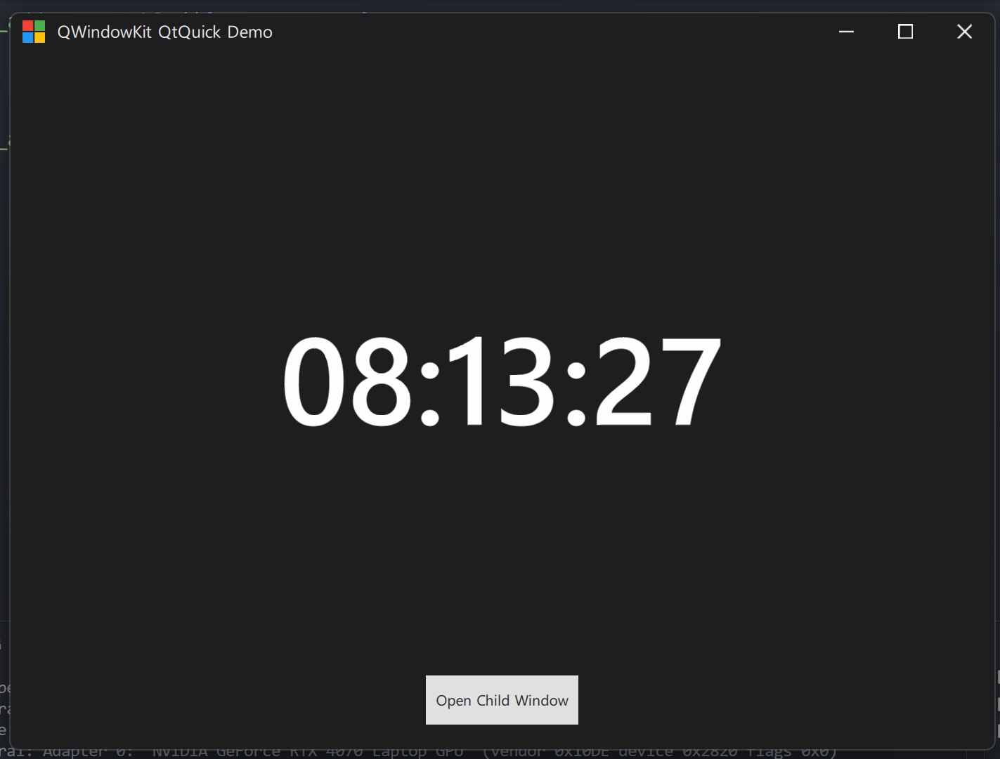
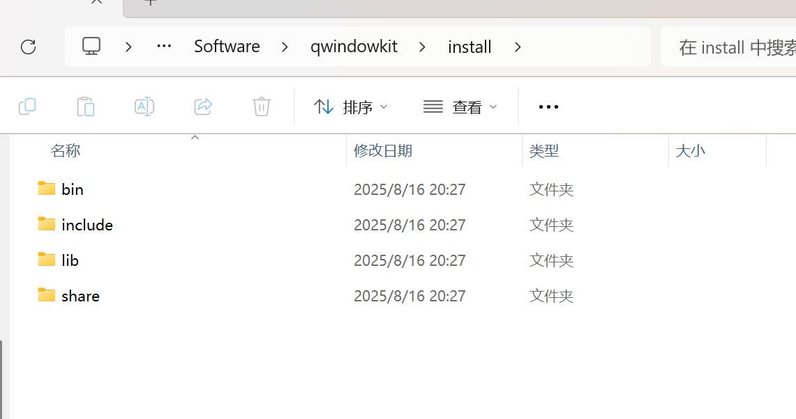

# Qt6_QWindowKit_QML_demo

Qt6的QWindowKit QML的模板示例，可以直接在此基础上编写项目

- QWindowKit 1.4.0 - Release



## 先编译QWindowKit

```sh
git clone --recursive https://github.com/stdware/qwindowkit
cd qwindowkit

# 删\
cmake -B build -S . \
  -DCMAKE_PREFIX_PATH=<QT_DIR> \ # Qt安装路径
  -Dqmsetup_DIR=<dir> \             # Optional 项目中已有此模块，可忽略
  -DQWINDOWKIT_BUILD_QUICK=TRUE \   # Optional 是否编译支持QML
  -DCMAKE_INSTALL_PREFIX=/path/install \ # 安装路径
  -G "Ninja Multi-Config"

# 编译中间文件存放    install 结果处理函数，文件移动到-DCMAKE_INSTALL_PREFIX 路径
cmake --build build --target install --config Debug
cmake --build build --target install --config Release
```

```sh
PS D:\Software\qwindowkit> cmake -B build -S . -DCMAKE_PREFIX_PATH="D:\Software\Qt\6.9.1\msvc2022_64" -DQWINDOWKIT_BUILD_QUICK=TRUE -DCMAKE_INSTALL_PREFIX="${PWD}/install" -G "Visual Studio 17 2022"
cmake --build build --target install --config Release
```


> 默认编译的是动态库





## 编译本项目


配置主 `CMakeLists.txt`的

```cmake
list(APPENDCMAKE_PREFIX_PATH"D:/Software/qwindowkit/install/lib/cmake")
```

和 `FindQWindowKit`

```cmake
    if (NOT QWINDOWKIT_ROOT_DIR)
        set(QWINDOWKIT_ROOT_DIR "D:/Software/qwindowkit/install"
            CACHE PATH "QWindowKit root directory")
    endif()
```


编译

```sh
cmake --build . --config Release # --config看你QWindowKit的编译类型
```
