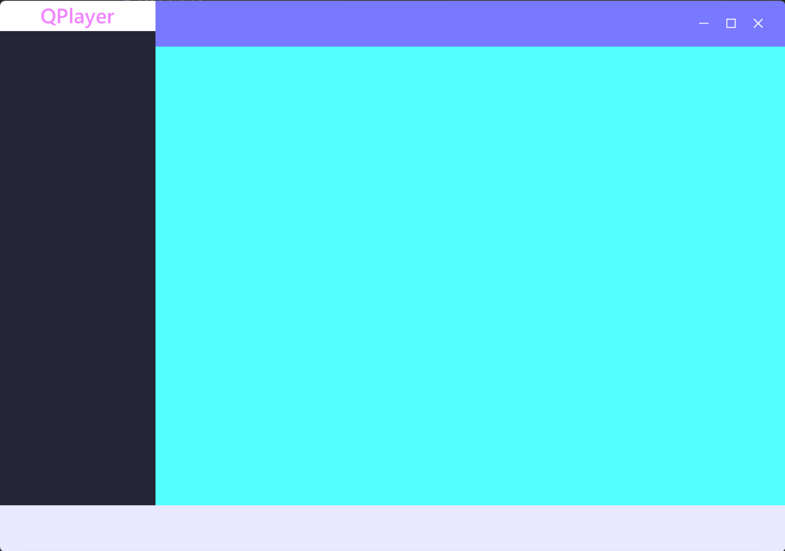

# QML QWindowKit Demo

QWindowKit 作为三方库快速启用的模板



## 项目结构

```
QML_MusicPlay/
├── cmake/                 # CMake 配置文件
│   ├── external/          # 外部依赖配置
│   │   └── qwindowkit.cmake
│   └── qtruntime.cmake
├── main.cpp               # 应用程序入口
├── main.qml               # 主界面 QML 文件
├── FramelessWindow.qml    # 无边框窗口 QML 组件
└── CMakeLists.txt         # CMake 构建配置
```

## 构建

```bash
# 克隆项目
git clone <repository-url>
cd QML_MusicPlay

# Debug 构建
cmake -S . -B build -DCMAKE_BUILD_TYPE=Debug
cmake --build build --target all

# Release 构建
cmake -S . -B build -DCMAKE_BUILD_TYPE=Release
cmake --build build --target all
```
